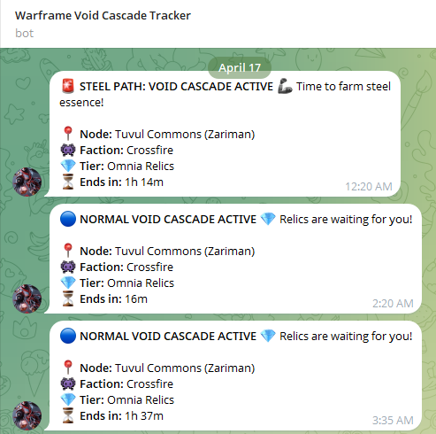
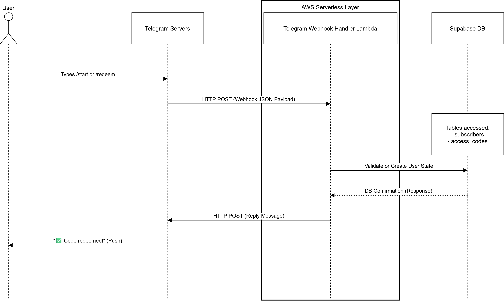
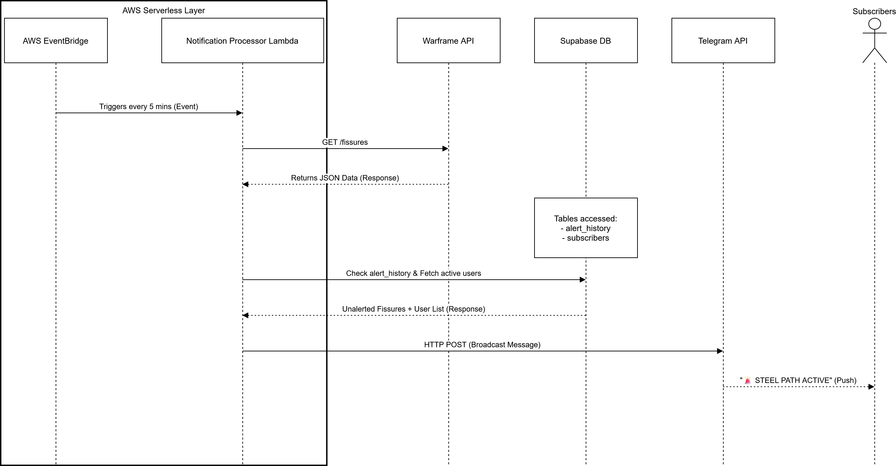

# Serverless Event-Driven Monitor (Warframe API)

*Real-time Telegram alerts delivered via AWS Lambda webhook integration.*

An event-driven, fully managed serverless architecture designed to poll the Warframe Community API, track specific game states (Void Cascade/Steel Path), and broadcast real-time webhook alerts to registered users via a Telegram Bot.

## Architecture & Tech Stack

This project was built to demonstrate decoupled, serverless cloud engineering using the AWS Free Tier and Supabase. The system operates on a continuous 5-minute polling interval (processing over 8,600 automated executions per month) with virtually no infrastructure overhead.

* **Compute:** AWS Lambda (Python 3.x), AWS EventBridge (Cron Orchestration)
* **Database:** Supabase (PostgreSQL)
* **Integration:** Telegram Bot API (Webhook based)
* **Architecture:** Event-Driven, Stateless, Idempotent design

## System Architecture Diagrams

### 1. User Authentication Flow (Webhook)
This flow handles user registration and access code validation in real-time.

*Sequence diagram detailing the secure webhook relay between Telegram servers, AWS Lambda, and Supabase.*

### 2. Event-Driven Broadcast Flow (Cron Polling)
This background process runs every 5 minutes, completely decoupled from user interaction.

*Sequence diagram showing the automated API polling, duplicate checking, and targeted broadcast pipeline.*

## Core Engineering Features

* **Serverless Execution:** Entire logic runs on AWS Lambda functions (one for API polling, one for Telegram Webhooks), ensuring zero idle compute costs.
* **Idempotency & State Management:** Fissure IDs are cached in a Supabase PostgreSQL table before broadcasting. This prevents duplicate alerts in the event of Lambda retries or API hiccups.
* **Zero-Dependency Deployment:** Python code utilizes native standard libraries (`urllib`, `json`) rather than heavy third-party SDKs (`requests`), drastically reducing Lambda deployment package size and cold-start times.
* **Native CloudWatch Logging:** Standard `print()` statements replaced with Python's native `logging` module to ensure errors are correctly tagged with severity levels in AWS CloudWatch.

## Setup & Deployment

To replicate this architecture:

1. **Environment Variables:** Configure `TELEGRAM_TOKEN`, `SUPABASE_URL`, and `SUPABASE_KEY` inside your Lambda environments.
2. **Database:** Set up a Supabase PostgreSQL instance with three tables: `subscribers`, `access_codes`, and `alert_history`.
3. **Compute:** Deploy the webhook and broadcast scripts as two separate AWS Lambda functions.
4. **Triggers:** Attach an AWS API Gateway URL to the Webhook Lambda (and register it with Telegram), and attach an EventBridge rule (rate: 5 minutes) to the Broadcast Lambda.

## Future Architecture Improvements

While this MVP successfully demonstrates a serverless event-processing and notification flow, scaling it to a production-grade application would involve:

* **Multi-Channel Fan-Out (Discord):** Expanding the notification layer beyond Telegram. Implementing Discord Webhooks for seamless gaming community integration without requiring complex Bot API setups.
* **Decoupled Broadcast Architecture:** Replacing the synchronous Python `for` loop with an Amazon SNS (Simple Notification Service) topic. This would allow the primary Lambda to publish a single event, triggering hundreds of worker Lambdas concurrently to prevent timeout limits during massive user broadcasts.
* **Infrastructure as Code (IaC):** Migrating the manual AWS console configurations to Terraform or AWS SAM to version-control the cloud infrastructure and enable automated CI/CD deployments via GitHub Actions.
* **Unified Web Frontend (Multi-Game Ecosystem):** Developing a centralized web portal (e.g., using React/Next.js) to aggregate this and future microservices. This will allow users to manage their cross-game alert preferences from a single dashboard, evolving the project from a standalone bot into a comprehensive competitive gaming utility suite.
